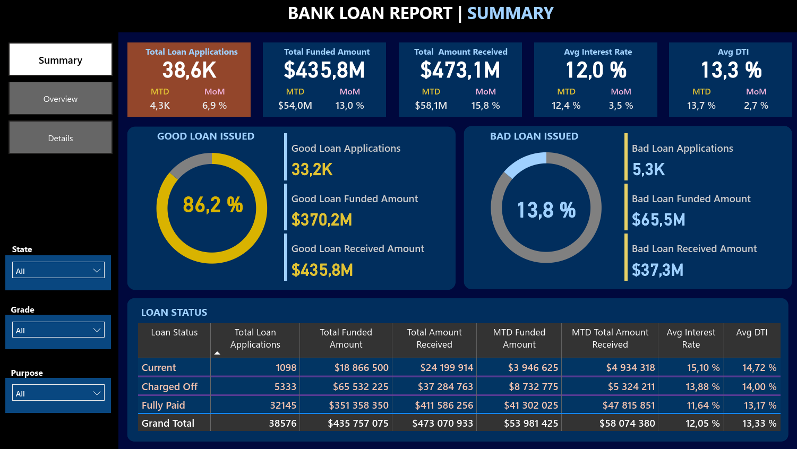

#  Projekt: Dashboard bankovních půjček

## Kontext
Společnost poskytující osobní půjčky potřebuje přehledné a interaktivní řešení pro sledování a analýzu svých půjček.  
Vzhledem k velkému množství žádostí a financovaných částek je důležité mít nástroj umožňující sledování klíčových metrik a trendů v čase.

###  Soubory ke stažení
-  [Power BI report](Bank%20Loan%20Report.pbix) – Dashboard bankovních půjček v Power BI
-  [PDF](Dashboard%20bankovních%20půjček%20SQL%20dotazy.pdf) – Analýza pomocí SQL dotazů
-  [PDF](Dashboard%20bankovních%20půjček%20postup.pdf) – Postup vypracování projektu
-  [CSV](bank_loan_data.csv) – Dataset

## Cíl projektu
Cílem projektu je vytvořit vizuálně přehledný a interaktivní dashboard pomocí **Power BI**, který umožní managementu:
- Sledovat celkový počet žádostí o půjčku
- Kontrolovat celkovou financovanou částku a přijaté platby
- Vyhodnocovat průměrnou úrokovou sazbu a DTI (Debt-to-Income)
- Analyzovat trendy podle data vydání půjčky
- Porovnávat data mezi měsíci (MTD, MoM)
- Rozlišovat mezi různými stavy půjček (splacené, po splatnosti, defaultní)

## Data
- 38 576 záznamů

## Použité nástroje a technologie
- Excel, SQL, Power BI

##  Požadavky na KPI
- **Total Loan Applications** (počet žádostí)
  - Počet žádostí od začátku měsíce (MTD)
  - Měsíční změny (MoM)
- **Total Funded Amount** (vyplacená částka)
  - Celková vyplacená částka od začátku měsíce (MTD)
  - Měsíční změny (MoM)
- **Total Amount Received** (přijatá částka)
  - Přijatá částka od začátku měsíce (MTD)
  - Měsíční změny (MoM)
- **Average Interest Rate** (průměrná úroková sazba)
  - Průměrná sazba od začátku měsíce (MTD)
  - Měsíční změny (MoM)
- **Average Debt-to-Income Ratio (DTI)**
  - Průměrný DTI od začátku měsíce (MTD)
  - Měsíční změny (MoM)

##  Tabulka: Stav půjčky (Loan Status)
Tabulka obsahuje tyto metriky:
- Celkový počet žádostí
- Celková vyplacená částka
- Celková přijatá částka
- Vyplacená částka od začátku měsíce (MTD)
- Přijatá částka od začátku měsíce (MTD)
- Průměrná úroková sazba
- Průměrný DTI

##  Vizualizace
- **Monthly Trends by Issue Date – _Měsíční trendy podle data vydání_**  
Slouží k identifikaci sezónnosti a dlouhodobých trendů v úvěrových aktivitách.
- **Loan Term Analysis – _Analýza délky půjčky_**  
Umožňuje pochopit rozložení půjček podle různých délek splatnosti.
- **Employee Length Analysis – _Analýza délky zaměstnání_**  
Zobrazuje, jak jsou úvěrové metriky rozloženy mezi žadatele s různou délkou pracovního poměru, což pomáhá posoudit vliv pracovní historie na žádosti o půjčku.
- **Loan Purpose Breakdown – _Rozdělení účelu půjček_**  
Nabízí vizuální rozdělení úvěrových metrik podle uvedených účelů půjček a pomáhá pochopit hlavní důvody, proč si žadatelé půjčují.
- **Home Ownership Analysis – _Analýza vlastnictví nemovitosti_**  
Poskytuje hierarchický pohled na to, jak vlastnictví nemovitosti ovlivňuje žádosti o půjčku a jejich schválení.

##  Přínos
- Okamžitý přehled o výkonnosti portfolia půjček
- Odhalení sezónních trendů a regionálních rozdílů
- Efektivnější rozhodování založené na datech

##  Použité funkce v Power BI
- `SUM`, `COUNT`, `IF`
- `AVERAGE`
- `TOTALYTD`, `TOTALMTD`
- `CALCULATE`
- `SAMEPERIODLASTYEAR`
- `CONCATENATE`
- `DATESMTD`
- `DATEADD`

---
