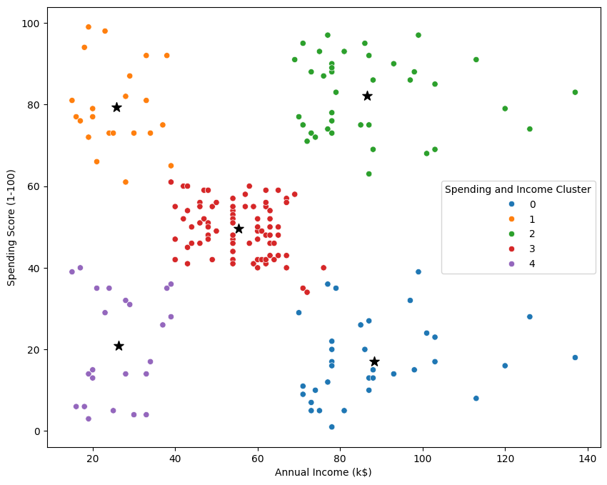

# 📈 Projekt: Segmentace zákazníků nákupního centra

## Kontext
Klient požaduje, abyste identifikovali nejdůležitější skupiny zákazníků na základě příjmu, věku a nákupního skóre v obchodním centru.  
Cílem je zjistit ideální počet skupin a přiřadit každé skupině vhodný název.

## Cíl projektu: Segmentace trhu
- Rozdělit cílový trh nákupního centra na snadno oslovitelné skupiny.
- Vytvořit podskupiny trhu na základě demografických a behaviorálních kritérií.
- Pochopit cílové zákazníky pro plánování marketingové strategie.

## Použité nástroje a technologie
- Python, Pandas, Seaborn, Matplotlib, Sklearn

## Vizualizace
- Histogram, Boxplot, Korelační matice, Scatterplot

## Data
- 200 záznamů

---

## Výsledky
- **Cílovou skupinou je klastr 2**, který má vysoké skóre utrácení a vysoký příjem.
- 60 % nakupujících v klastru 2 tvoří ženy.
- Doporučujeme zaměřit marketingové kampaně na produkty oblíbené v této skupině.
- **Klastr 1** (mladí impulzivní zákazníci) je ideální pro marketing prodejních akcí a limitovaných nabídek.

### Segmenty zákazníků
0. Starší zákazníci s vysokým příjmem, ale nízkým skóre utrácení (*spořiví*).  
1. Mladí zákazníci s nízkým příjmem, ale vysokým skóre utrácení (*impulzivní kupující*).  
2. Bohatí zákazníci, kteří hodně utrácejí (*VIP zákazníci*).  
3. Průměrní zákazníci s neutrálním chováním.  
4. Zákazníci s nízkým příjmem a nízkým utrácením (*minimální význam pro marketing*).

---

## 🧠 Postup analýzy zákazníků

### 1. Získání dat
- Analýza základních údajů: věk, příjem, skóre utrácení.
- Identifikace potenciálních skupin a rozdílů mezi pohlavími.

### 2. Vizualizace rozdělení hodnot
- Histogramy: rozložení věku, příjmu a skóre utrácení.
- Hustotní grafy: porovnání mužů a žen.
- Boxploty: identifikace extrémů a mediánu.

### 3. Příprava na klastrování
- Výběr klíčových proměnných: věk, příjem, skóre utrácení.

### 4. Hledání ideálního počtu skupin
- Použití metody kolena (Elbow method) k určení optimálního počtu klastrů.

### 5. Rozdělení zákazníků do skupin
- Použití algoritmu KMeans pro vytvoření 5 segmentů zákazníků.

### 6. Vizualizace klastrů
- Scatterploty znázorňující zákazníky podle příslušnosti ke klastru.

---

## ✅ Shrnutí
- Jasné rozdělení zákazníků podle jejich chování.
- Možnost cíleného marketingu – efektivnější kampaně.
- Podpora plánování nových služeb a produktů na základě dat.
- Nahrazení domněnek skutečnými analytickými poznatky.

---

